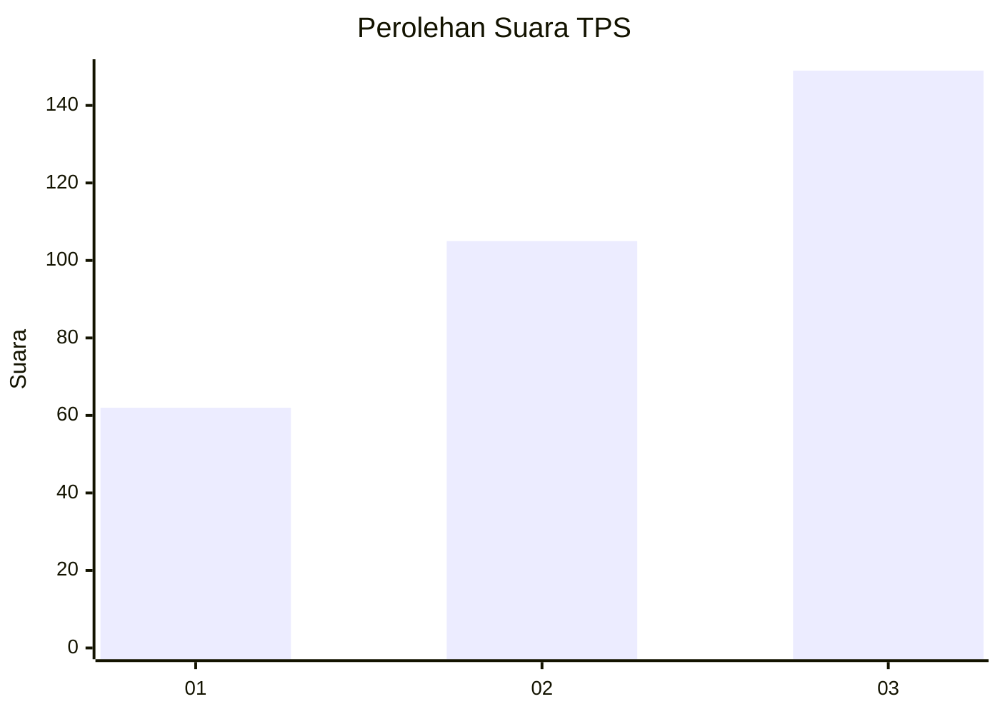
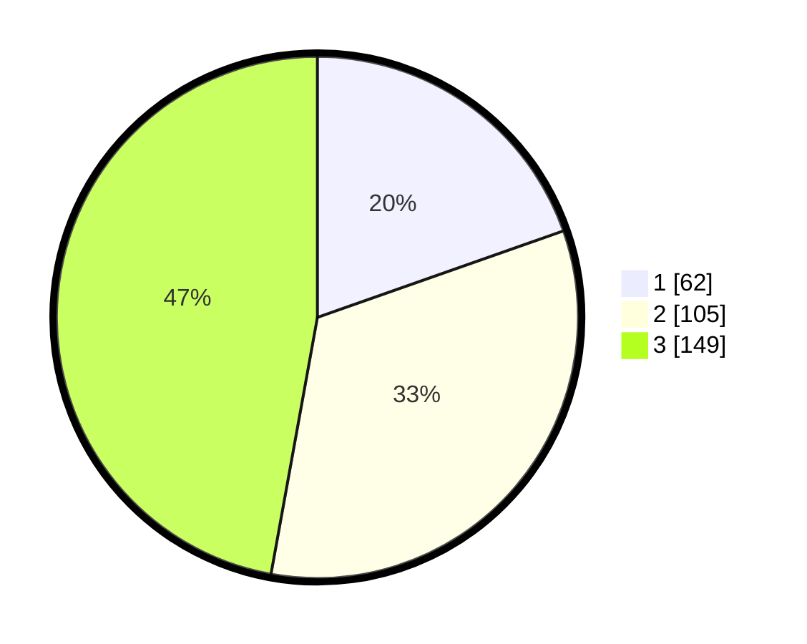

# Hasil

## Grafik

## Tabel

| No. | Nama Paslon    | Suara | Suara (raw) | Persentase |
|:--- |:-------------- | -----:| -----------:| ----------:|
| 1   | ANIES MUHAIMIN | 62    | [62][p-1]   | 19,62      |
| 2   | PRABOWO GIBRAN | 105   | [105][p-2]  | 33,23      |
| 3   | GANJAR MAHFUD  | 149   | [149][p-3]  | 47,15      |

[p-1]: https://github.com/gigit-pemilu/pemilu-2024-99-luar-negeri/blob/main/pilpres/hitung-suara/sub/99-luar-negeri/sub/99-roma-italia/sub/01-roma-italia/sub/0001-roma-italia/sub/002-tps-001/sub/paslon-1.txt
[p-2]: https://github.com/gigit-pemilu/pemilu-2024-99-luar-negeri/blob/main/pilpres/hitung-suara/sub/99-luar-negeri/sub/99-roma-italia/sub/01-roma-italia/sub/0001-roma-italia/sub/002-tps-001/sub/paslon-2.txt
[p-3]: https://github.com/gigit-pemilu/pemilu-2024-99-luar-negeri/blob/main/pilpres/hitung-suara/sub/99-luar-negeri/sub/99-roma-italia/sub/01-roma-italia/sub/0001-roma-italia/sub/002-tps-001/sub/paslon-3.txt

## Foto C Plano

https://sirekap-obj-formc.kpu.go.id/345a/pemilu/ppwp/99/99/01/00/01/9999010001002-20240216-135058--3cfa33a1-815e-47d2-8491-f1b1ebc6bbc4.jpg

https://sirekap-obj-formc.kpu.go.id/345a/pemilu/ppwp/99/99/01/00/01/9999010001002-20240216-135100--36dce963-adc2-427e-8b8f-bbfe6d50163b.jpg

https://sirekap-obj-formc.kpu.go.id/345a/pemilu/ppwp/99/99/01/00/01/9999010001002-20240216-135059--9773cbc2-d16f-4dd0-8e32-cfdbe5d0eadf.jpg

## Metadata

| Key        | Value               |
| ---------- | ------------------- |
| Time Stamp | 2024-02-19 06:16:00 |

## DATA PEMILIH TETAP

Jumlah pemilih dalam DPT: **624**.
 * L: **194**.
 * P: **430**.

## DATA PENGGUNA HAK PILIH

Jumlah pengguna hak pilih dalam DPT: **226**.
 * L: **35**.
 * P: **191**.

Jumlah pengguna hak pilih dalam DPTb: **83**.
 * L: **13**.
 * P: **70**.

Jumlah pengguna hak pilih dalam DPK: **12**.
 * L: **0**.
 * P: **12**.

Jumlah pengguna hak pilih: **321**.
 * L: **48**.
 * P: **273**.

## JUMLAH SUARA SAH DAN TIDAK SAH

JUMLAH SELURUH SUARA SAH: **316**.

JUMLAH SUARA TIDAK SAH: **5**.

JUMLAH SELURUH SUARA SAH DAN SUARA TIDAK SAH: **321**.

