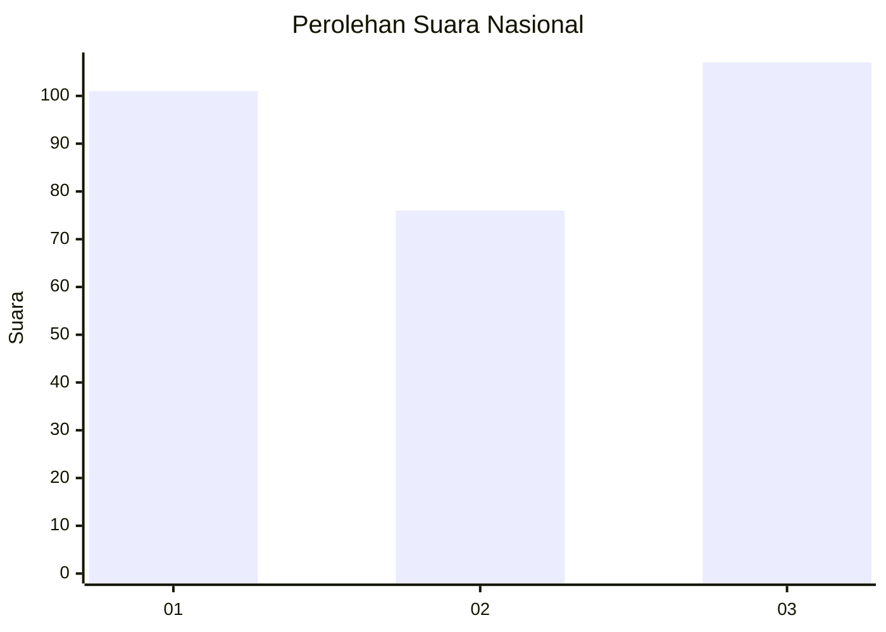
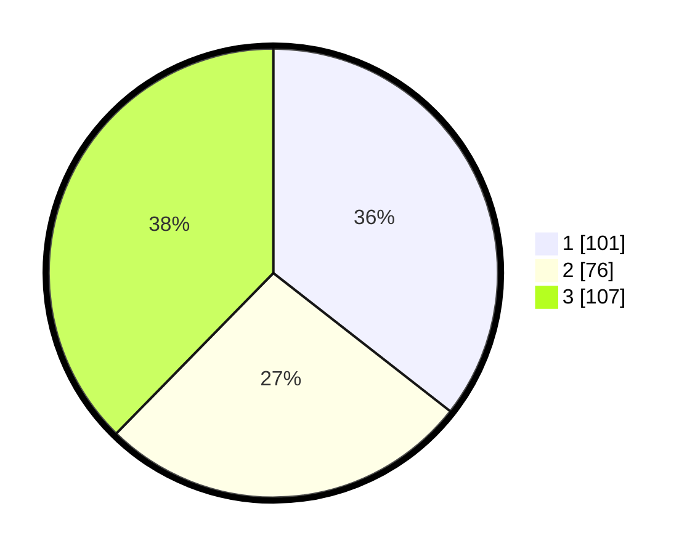

# Hasil

## Grafik

## Tabel

| No. | Nama Paslon    | Suara | Suara (raw) | Persentase |
|:--- |:-------------- | -----:| -----------:| ----------:|
| 1   | ANIES MUHAIMIN | 101   | [101][p-1]  | 35,56      |
| 2   | PRABOWO GIBRAN | 76    | [76][p-2]   | 26,76      |
| 3   | GANJAR MAHFUD  | 107   | [107][p-3]  | 37,68      |

[p-1]: https://github.com/gigit-pemilu/pemilu-2024/blob/main/pilpres/hitung-suara/sub/99-luar-negeri/sub/99-roma-italia/sub/01-roma-italia/sub/0001-roma-italia/sub/003-ksk-001/sub/paslon-1.txt
[p-2]: https://github.com/gigit-pemilu/pemilu-2024/blob/main/pilpres/hitung-suara/sub/99-luar-negeri/sub/99-roma-italia/sub/01-roma-italia/sub/0001-roma-italia/sub/003-ksk-001/sub/paslon-2.txt
[p-3]: https://github.com/gigit-pemilu/pemilu-2024/blob/main/pilpres/hitung-suara/sub/99-luar-negeri/sub/99-roma-italia/sub/01-roma-italia/sub/0001-roma-italia/sub/003-ksk-001/sub/paslon-3.txt

## Foto C Plano

https://sirekap-obj-formc.kpu.go.id/27ab/pemilu/ppwp/99/99/01/00/01/9999010001003-20240215-235822--11a6bd7f-8050-46cd-beba-431252779e65.jpg

https://sirekap-obj-formc.kpu.go.id/27ab/pemilu/ppwp/99/99/01/00/01/9999010001003-20240216-091056--e5755fec-79d8-45e1-9d53-0be57c4b5e70.jpg

https://sirekap-obj-formc.kpu.go.id/27ab/pemilu/ppwp/99/99/01/00/01/9999010001003-20240215-235824--9df76773-d886-4b58-bf6f-67ce2d37a4d8.jpg

## Metadata

| Key        | Value               |
| ---------- | ------------------- |
| Time Stamp | 2024-02-19 06:16:00 |

## DATA PEMILIH TETAP

Jumlah pemilih dalam DPT: **307**.
 * L: **100**.
 * P: **207**.

## DATA PENGGUNA HAK PILIH

Jumlah pengguna hak pilih dalam DPT: **110**.
 * L: **34**.
 * P: **76**.

Jumlah pengguna hak pilih dalam DPTb: **142**.
 * L: **61**.
 * P: **81**.

Jumlah pengguna hak pilih dalam DPK: **35**.
 * L: **11**.
 * P: **24**.

Jumlah pengguna hak pilih: **287**.
 * L: **103**.
 * P: **184**.

## JUMLAH SUARA SAH DAN TIDAK SAH

JUMLAH SELURUH SUARA SAH: **284**.

JUMLAH SUARA TIDAK SAH: **3**.

JUMLAH SELURUH SUARA SAH DAN SUARA TIDAK SAH: **287**.

