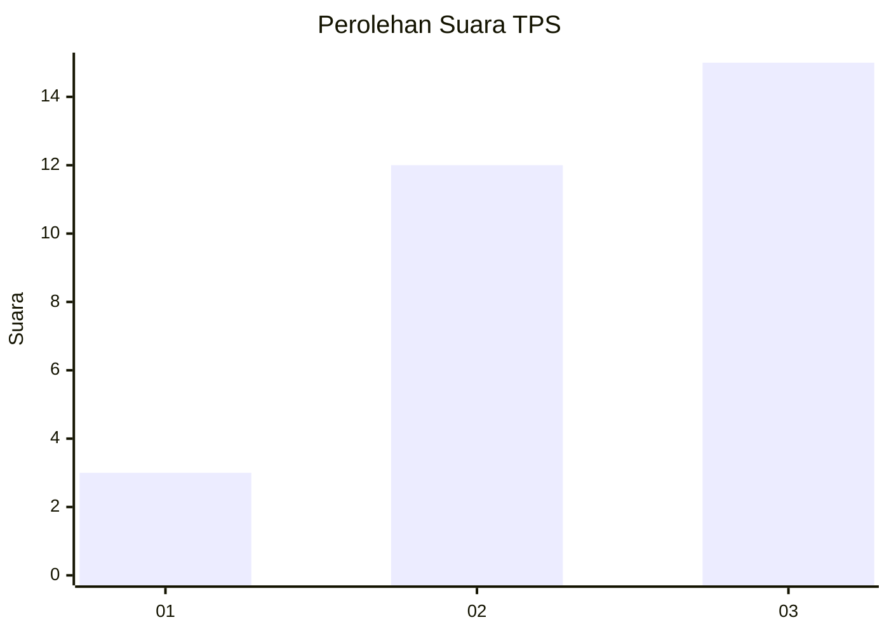
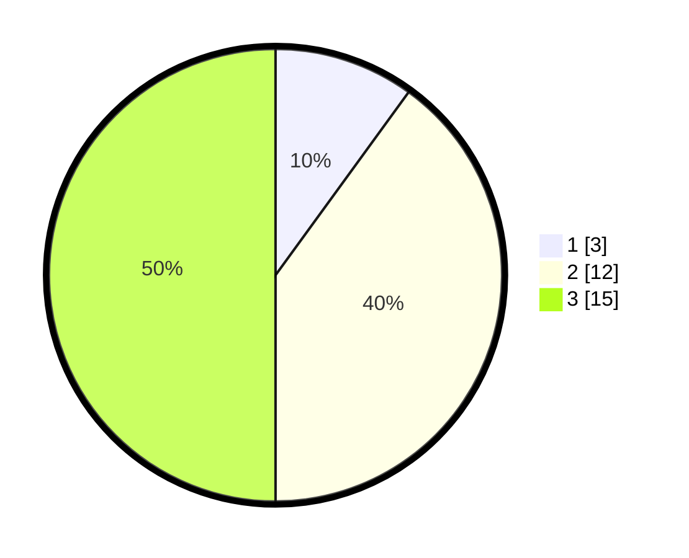

# Hasil

## Grafik

## Tabel

| No. | Nama Paslon    | Suara | Suara (raw) | Persentase |
|:--- |:-------------- | -----:| -----------:| ----------:|
| 1   | ANIES MUHAIMIN | 3     | [3][p-1]    | 10,00      |
| 2   | PRABOWO GIBRAN | 12    | [12][p-2]   | 40,00      |
| 3   | GANJAR MAHFUD  | 15    | [15][p-3]   | 50,00      |

[p-1]: https://github.com/gigit-pemilu/pemilu-2024-99-luar-negeri/blob/main/pilpres/hitung-suara/sub/99-luar-negeri/sub/99-roma-italia/sub/01-roma-italia/sub/0001-roma-italia/sub/004-ksk-002/sub/paslon-1.txt
[p-2]: https://github.com/gigit-pemilu/pemilu-2024-99-luar-negeri/blob/main/pilpres/hitung-suara/sub/99-luar-negeri/sub/99-roma-italia/sub/01-roma-italia/sub/0001-roma-italia/sub/004-ksk-002/sub/paslon-2.txt
[p-3]: https://github.com/gigit-pemilu/pemilu-2024-99-luar-negeri/blob/main/pilpres/hitung-suara/sub/99-luar-negeri/sub/99-roma-italia/sub/01-roma-italia/sub/0001-roma-italia/sub/004-ksk-002/sub/paslon-3.txt

## Foto C Plano

https://sirekap-obj-formc.kpu.go.id/4426/pemilu/ppwp/99/99/01/00/01/9999010001004-20240214-220357--7b762dd8-c632-4cea-979e-617584c369fc.jpg

https://sirekap-obj-formc.kpu.go.id/4426/pemilu/ppwp/99/99/01/00/01/9999010001004-20240216-014427--bdae72ab-5155-4283-a87e-6e2cc4854a4e.jpg

https://sirekap-obj-formc.kpu.go.id/4426/pemilu/ppwp/99/99/01/00/01/9999010001004-20240216-014426--7bf54382-ff63-41c3-8a8a-fcca50c6c6f5.jpg

## Metadata

| Key        | Value               |
| ---------- | ------------------- |
| Time Stamp | 2024-03-03 20:00:00 |

## DATA PEMILIH TETAP

Jumlah pemilih dalam DPT: **61**.
 * L: **11**.
 * P: **50**.

## DATA PENGGUNA HAK PILIH

Jumlah pengguna hak pilih dalam DPT: **23**.
 * L: **2**.
 * P: **21**.

Jumlah pengguna hak pilih dalam DPTb: **5**.
 * L: **3**.
 * P: **2**.

Jumlah pengguna hak pilih dalam DPK: **2**.
 * L: **2**.
 * P: **0**.

Jumlah pengguna hak pilih: **30**.
 * L: **7**.
 * P: **23**.

## JUMLAH SUARA SAH DAN TIDAK SAH

JUMLAH SELURUH SUARA SAH: **30**.

JUMLAH SUARA TIDAK SAH: **0**.

JUMLAH SELURUH SUARA SAH DAN SUARA TIDAK SAH: **30**.

