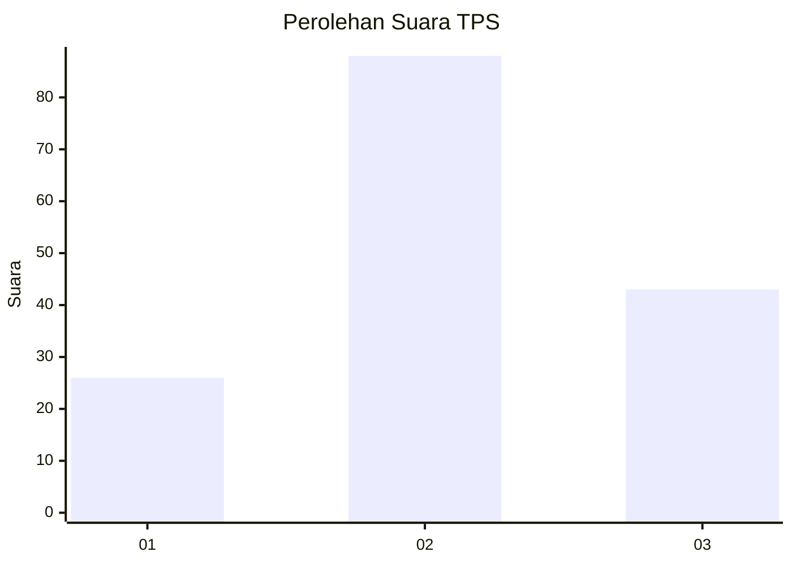
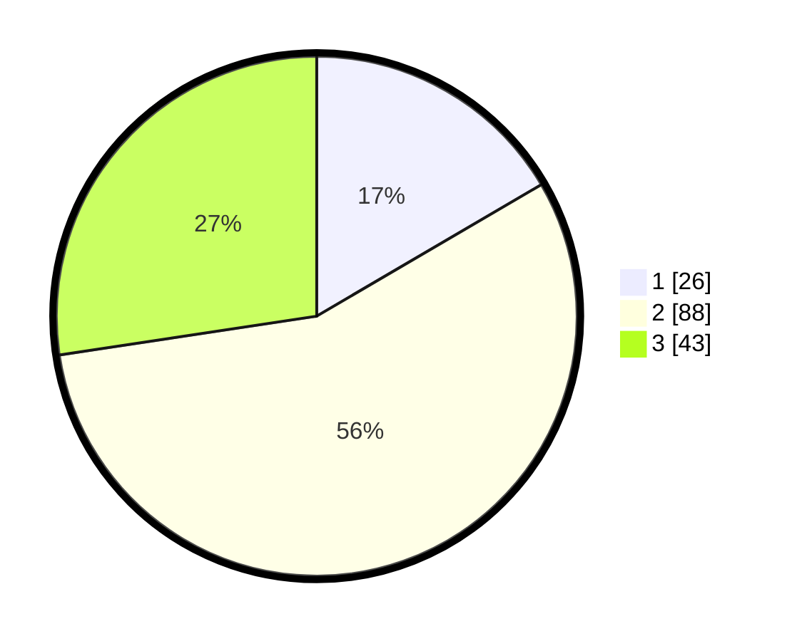

# Hasil

## Grafik

## Tabel

| No. | Nama Paslon    | Suara | Suara (raw) | Persentase |
|:--- |:-------------- | -----:| -----------:| ----------:|
| 1   | ANIES MUHAIMIN | 26    | [26][p-1]   | 16,56      |
| 2   | PRABOWO GIBRAN | 88    | [88][p-2]   | 56,05      |
| 3   | GANJAR MAHFUD  | 43    | [43][p-3]   | 27,39      |

[p-1]: https://github.com/gigit-pemilu/pemilu-2024-99-luar-negeri/blob/main/pilpres/hitung-suara/sub/99-luar-negeri/sub/99-roma-italia/sub/01-roma-italia/sub/0001-roma-italia/sub/005-ksk-003/sub/paslon-1.txt
[p-2]: https://github.com/gigit-pemilu/pemilu-2024-99-luar-negeri/blob/main/pilpres/hitung-suara/sub/99-luar-negeri/sub/99-roma-italia/sub/01-roma-italia/sub/0001-roma-italia/sub/005-ksk-003/sub/paslon-2.txt
[p-3]: https://github.com/gigit-pemilu/pemilu-2024-99-luar-negeri/blob/main/pilpres/hitung-suara/sub/99-luar-negeri/sub/99-roma-italia/sub/01-roma-italia/sub/0001-roma-italia/sub/005-ksk-003/sub/paslon-3.txt

## Foto C Plano

https://sirekap-obj-formc.kpu.go.id/80ce/pemilu/ppwp/99/99/01/00/01/9999010001005-20240216-002007--29673444-ed96-470a-bd91-cd03e10b2bf4.jpg

https://sirekap-obj-formc.kpu.go.id/80ce/pemilu/ppwp/99/99/01/00/01/9999010001005-20240216-002010--64e353e4-eca2-4d4e-9b07-b61eb5fb2ab7.jpg

https://sirekap-obj-formc.kpu.go.id/80ce/pemilu/ppwp/99/99/01/00/01/9999010001005-20240216-002009--b22c117e-4ecf-46e7-b123-0bc7f96fa18a.jpg

## Metadata

| Key        | Value               |
| ---------- | ------------------- |
| Time Stamp | 2024-02-19 06:16:00 |

## DATA PEMILIH TETAP

Jumlah pemilih dalam DPT: **212**.
 * L: **180**.
 * P: **32**.

## DATA PENGGUNA HAK PILIH

Jumlah pengguna hak pilih dalam DPT: **79**.
 * L: **64**.
 * P: **15**.

Jumlah pengguna hak pilih dalam DPTb: **31**.
 * L: **24**.
 * P: **7**.

Jumlah pengguna hak pilih dalam DPK: **47**.
 * L: **46**.
 * P: **1**.

Jumlah pengguna hak pilih: **157**.
 * L: **134**.
 * P: **23**.

## JUMLAH SUARA SAH DAN TIDAK SAH

JUMLAH SELURUH SUARA SAH: **145**.

JUMLAH SUARA TIDAK SAH: **12**.

JUMLAH SELURUH SUARA SAH DAN SUARA TIDAK SAH: **157**.

